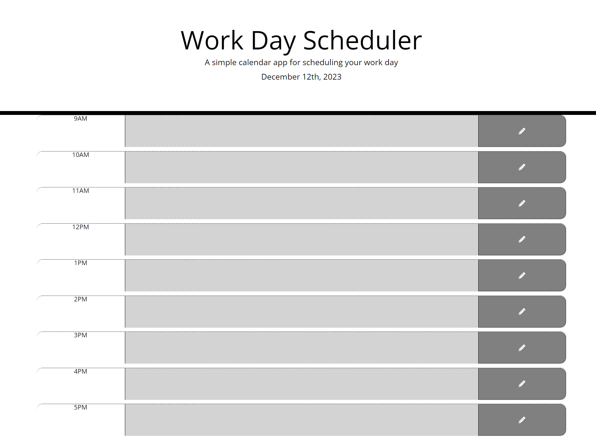

# Day Planner

My solution to the Module 7 challenge of the edX front-end bootcamp. It's a simple day planner that saves tasks to local storage.

## Usage
Open `index.html` in a web browser.

## Credits
* [Bootstrap](https://getbootstrap.com)
* [Day.js](https://day.js.org)
* [Font Awesome](https://fontawesome.com)
* [jQuery](https://jquery.com)